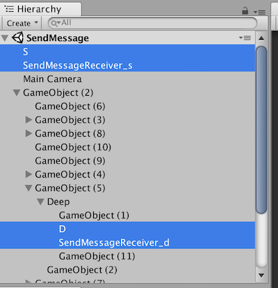
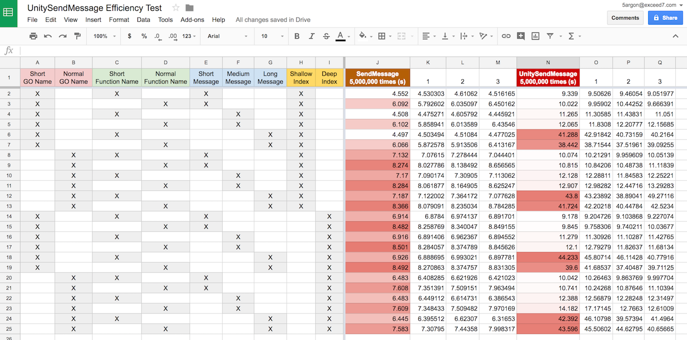
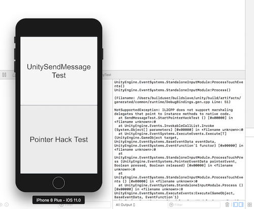
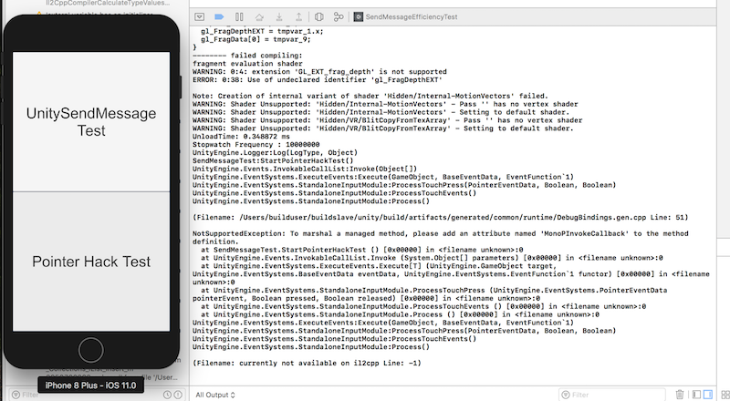

# UnitySendMessageEfficiencyTest

Using `gameObject.SendMessage(methodName, message)` in Unity might be best avoided by various means, but `UnitySendMessage(gameObjectName, methodName, message)` [in the native side](https://docs.unity3d.com/Manual/PluginsForIOS.html) is one of a few ways that a native plugin can talk back to C#.

I am building a native touch input plugin to solve a [perceived audio latency problem](https://github.com/5argon/UnityiOSNativeAudio). The only bottleneck is this `UnitySendMessage` method so that the plugin can tell the touch result to Unity. I want this to be as fast as possible but seeing that it consists of 3 string searches worries me. In this experiment I will confirm various things that might affect the performance of this call.

Feel free to put a reference to this page if you are also building a native plugin and wants your user to be aware of some performance implications.

## Experiment Setup

This repo is a `Stopwatch` project that time a method call 5,000,000 times for each situations. We will run this in the Editor and time `gameObject.SendMessage`, then run this again in XCode and time `UnitySendMessage` from the iOS native plugin that I also have included.

You might say `gameObject.SendMessage` is unrelated to the native plugin objective but seeing that it might be similar in how it uses strings for searching we might reveal something interesting. This method requires a `gameObject` reference and not a string so to make it fair I use `Find(gameObjectName).SendMessage` instead of a reference. (It might search in a similar way)

## Variables

1. **GameObject name** : Short (`S`, `D`) and normal (`SendMessageReceiver_s`, `SendMessageReceiver_d`). The s and d stands for shallow and deep.
2. **Hierarchy position** : Shallow and deep. Shallow means putting the GameObject as shallow as possible and also at the top. Deep means it is several childrens inside.



3. **Function name** : The short ones is `public void F(string message)` and the normal ones is `public void ReceiverFunction(string message)`. I have further bury them among other functions, just in case that make things more realistic.

```
public class Receiver : MonoBehaviour {

	public static int checker = 0;
	public static void ResetChecker()
	{
		checker = 0;
	}

	public void OtherMethods1()
	{
	}

	public void OtherMethods2()
	{
	}

	public void OtherMethods3()
	{
	}

    public void F(string message)
	{
		checker++;
		//Debug.Log("Call Success");
		//Debug.Log(checker);
	}

    public void ReceiverFunction(string message)
	{
		checker++;
		//Debug.Log("Call Success");
		//Debug.Log(checker);
	}

    public void OtherMethods4()
	{
	}

}


```


4. **Message length** :

`shortMessage = "m";`

 `normalMessage = "437.32|324.84|5argon|44389,313";`
 
 `longMessage = "Lorem ipsum dolor sit amet, consectetur adipiscing elit. In id pulvinar nisi, ac iaculis ipsum. Ut lectus turpis, fringilla sed velit ut, convallis pretium risus. Praesent interdum blandit bibendum. Ut venenatis risus diam, eget vulputate ex imperdiet non. Nunc mattis commodo dui, at lacinia leo posuere nec. Nullam sollicitudin dolor non neque euismod maximus. Maecenas molestie hendrerit luctus. Maecenas fermentum, lacus quis accumsan finibus, dolor nulla ultrices justo, sed auctor quam justo sit amet ipsum. Class aptent taciti sociosqu ad litora torquent per conubia nostra, per inceptos himenaeos. Curabitur ut rutrum magna. Suspendisse potenti. Pellentesque hendrerit neque lacus, vel viverra nisi condimentum ut.";`

With that, we can build a test matrix like this. Each one will be run 3 times and I will average them. (So in total we call the method 15,000,000 times per case)


## Environment

Unity Editor : 2017.1.1f1

iOS : iPhone 8 Simulator on iOS11

## Results

This table took me 2 whole days!



[See the table in Google Sheet here](https://docs.google.com/a/exceed7.com/spreadsheets/d/1z7LdjeBsR-wCa4Vveq-CDjt0RgeJfk_XH2l0cJCy32s/edit?usp=sharing)

You will notice that Google Sheet's color scale is very handy, as you can already see some interesting pattern at a glance.

## Analysis

### Function name does matter for both Unity and native

You can clearly see a striped pattern of red color. On each row I have the function name alternate between short and normal, so this means the shorter one have better performance. This is true for both `SendMessage` and `UnitySendMessage`.

I assume that Unity might be comparing the string's character one by one.

### Message length matters a lot for native plugin, not so much for Unity

On the `UnitySendMessage` side it is very clear that large message adds up a lot to the time taken. But on the contrary it has no effect in `SendMessage`.

Native plugin might have more difficulty transporting a string back to Unity.

Note that I did not do any string conversion in the native side. It just come straight back.

```
extern "C" {

    void _NativeSendMessage(const char* gameObjectName, const char* methodName, const char* message) {
        UnitySendMessage(gameObjectName, methodName, message);
    }
    
}
```

### Shallower index does not help for native plugin, but seems to make Unity ones slower

This might be a sign that `Find(gameObjectName)` and the first parameter of `UnitySendMessage(gameObjectName...` have a different search mechanism.

I might assume that after the build to XCode, the order of objects in the scene might be linearized and become more efficient for searching. While the editor ones might have to do a linear search.

### Short GameObject name also matter a bit

Like 1-5% faster from my guess. I don't know, but I think in `UnitySendMessage`, the reason of the cell that go under 10 seconds is because of shorter GameObject name.

## Summary

For native plugin, make all the 3 parameters of `UnitySendMessage(gameObjectName,methodName,message)` as shortest as possible. The hierarchy position of the message receiver GameObject does not matter.

...this might cause problems if everyone starts telling their user to "name the object as short as possible, like just `A`!"  and then we might have a name conflict from different plugins. (haha)

# Extra Round : UnitySendMessage vs. pointer

There is a way to avoid `UnitySendMessage`'s 3 strings, that is passing the function pointer directly. I have add one more button that does this comparison.

## How it works

C# Side (managed)

```csharp
    [DllImport("__Internal")]
    private static extern void _PointerHackTest(ActionDelegate actionDelegate, string message);

    [MonoPInvokeCallback(typeof(ActionDelegate))]
    public static void PointerHackTargetStatic(string message)
    {
	Debug.Log("iOS says : " + message);
    }

    public delegate void ActionDelegate(string message);

    public void StartPointerHackTest()
    {
	_PointerHackTest(PointerHackTargetStatic, longMessage);
    }
```

Objective-C Side (unmanaged)
```obj-c
    typedef void (*ActionDelegate)(const char* message);

    void _PointerHackTest(ActionDelegate actionDelegate) {
         actionDelegate("hey");
    }
```

1. The downside is that the call back method must be static. It can't be an instance method like `UnitySendMessage`. On the contrary, the `UnitySendMessage` way must be an instance method. If it was a static a log message will says no receiver. If you try to use a non-static you will get this :



Or if you forgot to put that attribute you will get this :



2. Now you can have whatever method signature you want. No need to encrypt the answer as string.

## Results (2)

I have use the `longMessage` to call the pointer way vs. this :


```csharp
    //an instance version so UnitySendMessage can find it
    public void PointerHackTarget(string message)
    {
        counter++;
    }

.
.
.

	_NativeSendMessage(gameObject.name,"PointerHackTarget", longMessage);

```

The result of the 5,000,000 times call test x 3 times in a row is : 

**POINTER** : 27.09367, 27.66718, 27.46549 (seconds)

**UNITY SEND MESSAGE** : 41.17936, 41.66581, 42.94591 (seconds)

You have already know the 40s performance from the table. The pointer way is almost 2x faster.

## Summary (2)

Actually, for calling back from native to C# let's ditch the `UnitySendMessage` altogether and use the pointer way as much as possible. (haha)

If you need to reach a specific GameObject then you can't avoid `UnitySendMessage`. If it can be a static then you should use the pointer way.